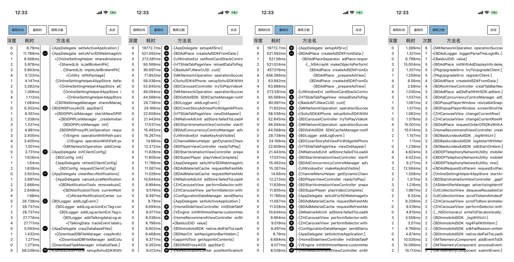
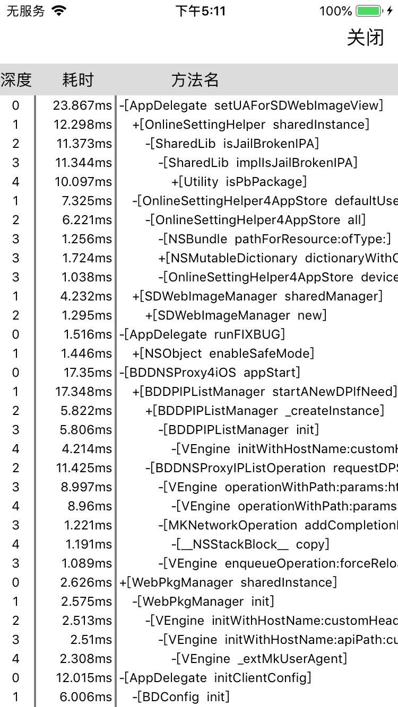

# TimeProfiler
Recording all OC methods in the main thread takes time

# 更新计划
## 1.1版本：增加耗时方法排序功能和耗时方法中调用次数排序功能（已做）

## 1.2版本：优化代码质量和性能问题（未做） 
## 1.3版本：增加打印卡顿时候，所有线程堆栈 （未做）

# 效果
## 1.0版本

# 特性
1. 记录所有在主线程运行的OC方法的耗时情况
2. 支持设置记录的最大深度和最小耗时

# 支持机型
iPhone5s及更新真机（arm64）

# 用法
## 启动监控
在以下地方：
1. 程序 main 函数入口；
2. AppDelegate 中的 application:didFinishLaunchingWithOptions:；
3. 你想开始的监控点

导入头文件#include "TPCallTrace.h"。
调用startTrace()。 
void setMaxDepth(int depth);  //设置最大深度
void setCostMinTime(uint64_t ms_time);    //设置最小耗时，注意，是毫秒

把TimeProfiler文件夹放入项目中，run App后，摇一摇App，就可以看到主线程运行的OC方法的耗时情况

# 原理介绍
[博客](https://juejin.im/post/5d146490f265da1bc37f2065)

